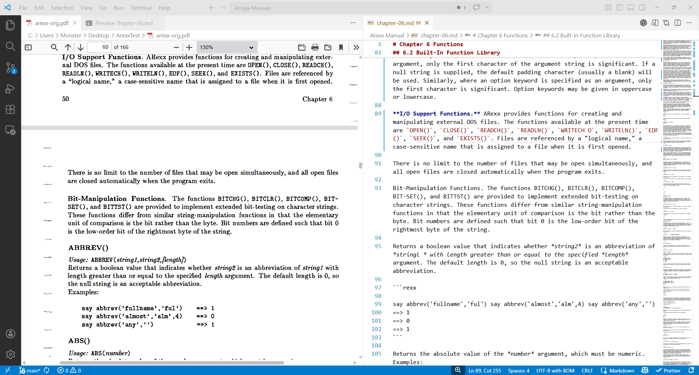

# Amiga Manuals (OCR → Markdown)

This repository contains Amiga-related manuals and books converted from scanned PDFs into clean, readable Markdown.

## Completed Manuals

* [x] [ARexx User's Reference Manual](https://github.com/mesutschwarz/Amiga-Manuals/blob/main/Arexx%20User%20Reference%20Manual.md), 1987 *William S. Hawes* (2026-04-24)
* [x] [WShell – The Beachcomber's Guide to WShell Version 2.0](https://github.com/mesutschwarz/Amiga-Manuals/blob/main/WShell%20v2.0%20Manual.md), © 1988, 1991 *William S. Hawes* (2026-04-20)

## What

* Scanned paper manuals → OCR
* OCR output → cleaned and structured
* Final result → **readable Markdown documents**

## Why

* PDFs are hard to read and search
* Markdown is simple, clean, and future-proof
* Also useful as a **dataset for AI models** (Amiga, ARexx, AmigaDOS, etc.)

## How

1. **OCR**: Use OCR software to extract text from scanned PDFs
2. **Cleaning**: Manually clean up OCR errors, fix formatting, and structure the content
3. **Markdown**: Convert the cleaned text into Markdown format for easy reading and editing

## Work in Progress

* [ ] AMIGA Programmer's Guide to ARexx

## Notes

* If you want support the project, please send DM
* Documents are continuously improved
